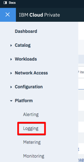
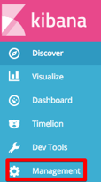
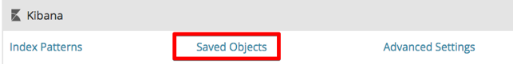
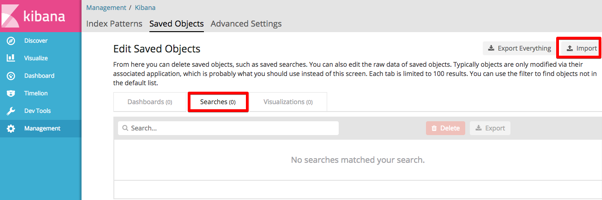
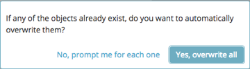
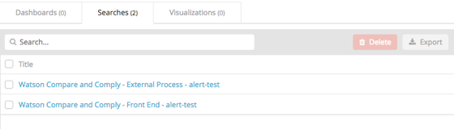
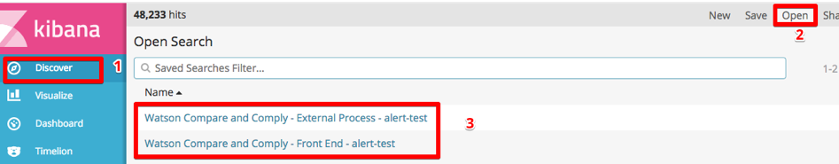
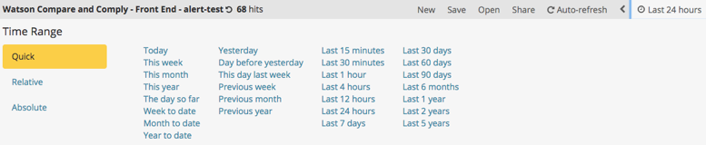

---

copyright:
years: 2017, 2018
lastupdated: "2018-08-17"

---

{:shortdesc: .shortdesc}
{:new_window: target="_blank"}
{:tip: .tip}
{:pre: .pre}
{:codeblock: .codeblock}
{:screen: .screen}
{:javascript: .ph data-hd-programlang='javascript'}
{:java: .ph data-hd-programlang='java'}
{:python: .ph data-hd-programlang='python'}
{:swift: .ph data-hd-programlang='swift'}

# Using logging
{: #logging}

## Importing the logging dashboards

To import the logging dashboards for {{site.data.keyword.cnc_short}} into IBM Cloud Private, perform the following steps.

  1. Ensure that you have extracted and generated the logging dashboards as described in [Step 1: Download, extract, and render the dashboard templates](/docs/services/oss-compare-and-comply/monitor.html#monitor).

  1. Log in to your IBM Cloud Private cluster.

  1. From the Menu icon in the upper left-hand corner, select **Platform -> Logging**.  
      
    

  1. Click **Management** on the left-hand side of the Kibana interface.  
    

  1. Select the **Saved Objects** tab.
    

  1. Select the **Searches** tab and click **Import**.
    

  1. Individually import the `frontend-logging.json` and `external-process-logging.json` files that were generated in Step 6 of the preceding procedure. When prompted, click **Yes, overwrite all**.
     

  1. The dashboards appear in the **Searches** tab.
     

## Viewing the logging dashboards
{: #view}

To view the logging dashboards, perform the following steps.

  1. Navigate to the **Discover** tab.

  1. Click **Open** near the top right-hand side of the Kibana interface.

  1. Select the dashboard you want to view. There are two logging dashboards, for the service log and the external process log.
    

You can easily change the time range and the frequency of auto-refreshing:
  

