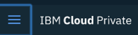
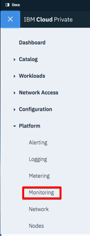
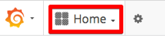
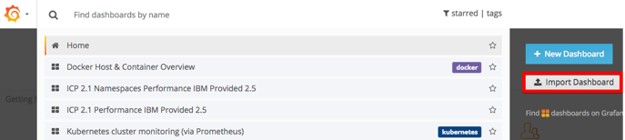
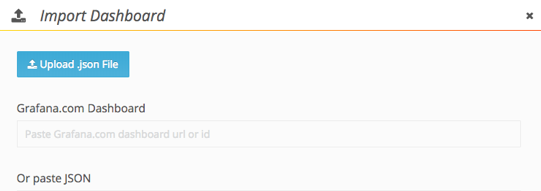
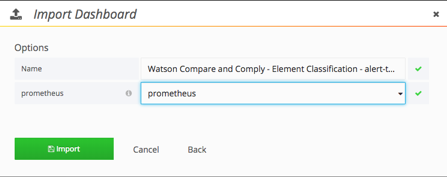
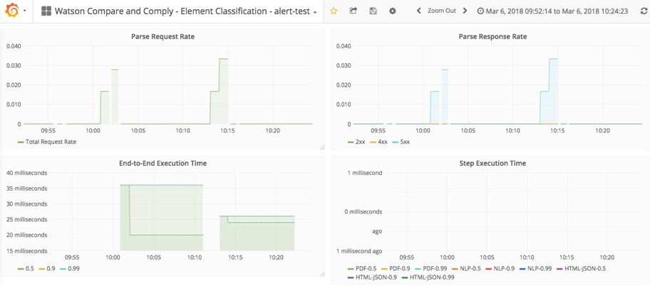
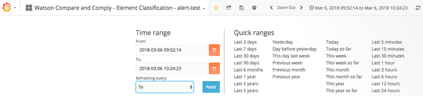

---

copyright:
  years: 2017, 2018
lastupdated: "2018-08-17"

---

{:shortdesc: .shortdesc}
{:new_window: target="_blank"}
{:tip: .tip}
{:pre: .pre}
{:codeblock: .codeblock}
{:screen: .screen}
{:javascript: .ph data-hd-programlang='javascript'}
{:java: .ph data-hd-programlang='java'}
{:python: .ph data-hd-programlang='python'}
{:swift: .ph data-hd-programlang='swift'}

# Using metrics
{: #metrics}

You can monitor the status of {{site.data.keyword.cnc_short}} by using IBM Cloud Private's monitoring dashboard. The monitoring dashboard uses Grafana for metrics, Prometheus for alerts, and Kibana for logging to present detailed information about your {{site.data.keyword.cnc_short}} instance.

## Importing the metrics dashboard

To import the metrics dashboard for {{site.data.keyword.cnc_short}} into IBM Cloud Private, perform the following steps.

  1. Ensure that you have extracted and generated the metrics dashboards as described in [Step 1: Download, extract, and render the dashboard templates](/docs/services/oss-compare-and-comply/monitor.html#monitor).

  1. Log in to your IBM Cloud Private cluster.

  1. From the Menu icon in the upper left-hand corner, select **Platform -> Monitoring**.  
        
      

  1. Click **Home** near the upper left of the Grafana interface.  
      

  1. Click **Import Dashboard**.
      

  1. Select the  `metrics.json` file that was generated in Step 6 of the preceding procedure, then click **Upload .json File**.  
      

  1. Select **Prometheus** as the data source, then click **Import**.
       

## Viewing the metrics dashboard
{: #view}

The metrics dashboard resembles the following:

You can easily change the time range and the frequency of auto-refreshing:

## Editing the metrics dashboard

You can edit the metrics dashboard or create a new dashboard by performing the following steps.

  1. From the Menu icon in the upper left-hand corner, select **Platform -> Monitoring** to access the Grafana UI.

  1. Click **Home** near the upper left of the Grafana interface, then click **+ New Dashboard**.

  1. Select the type of panel you want to add, such as **Graph** or **Table**.

  1. Click the panel title and then click **Edit**. The default panel title is `Panel title`.

  1. Use the **General** tab to set the panel's title, description, and dimensions. Note that 12 units is the full width of a browser window.

  1. Use the **Metrics** tab to create queries that display data from Prometheus.

    1. You can write the query directly if you are familiar with the query language, or you can use the **Metric lookup** field to choose from the metrics currently being reported to Prometheus.

    1. The results of the queries are displayed in real time in the new dashboard panel.

    1. Multiple queries can be added to a single panel. For example, you can display read and write operations on the same graph, or total visits and total visitors in the same table.
        
