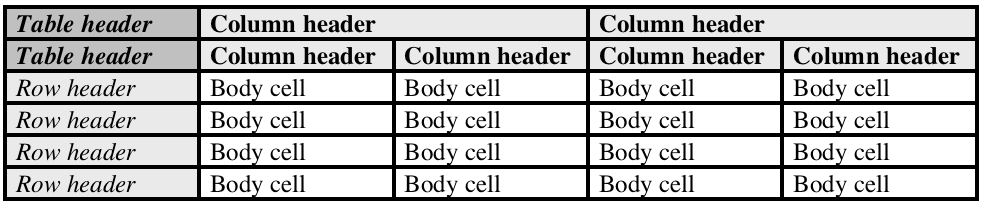

---

copyright:
years: 2018, 2019
lastupdated: "2019-02-01"

---

{:shortdesc: .shortdesc}
{:new_window: target="_blank"}
{:tip: .tip}
{:pre: .pre}
{:codeblock: .codeblock}
{:screen: .screen}
{:note: .note}
{:important: .important}
{:javascript: .ph data-hd-programlang='javascript'}
{:java: .ph data-hd-programlang='java'}
{:python: .ph data-hd-programlang='python'}
{:swift: .ph data-hd-programlang='swift'}

# Classifying tables
{: #understanding_tables}

You can classify the contents of tables in your [input document](/docs/services/compare-comply/formats.html#formats) by using the `POST /v1/tables` method. 

In a `bash` shell or equivalent environment such as Cygwin, use the `POST /v1/tables` method to classify the contents of tables in your document. The method takes the following input parameters:
  - `version` (**required** `string`): A date in the format `YYYY-MM-DD` that identifies the specific version of the API to use when processing the request.
  - `file` (**required** `file`): The input file that is to be classified.
  - `model` (optional `string`): If this parameter is specified, the service runs the specified type of element classification. Currently, the only supported value is `contracts`.
  
Replace `{apikey}` with the API key you copied earlier and `{input_file}` with the path to the input file to parse.

```bash
curl -X POST -u "apikey:{apikey}" -F 'file=@{input_file}' https://gateway.watsonplatform.net/compare-comply/api/v1/tables?version=2018-10-15
```
{: codeblock}

See [Classifying elements](/docs/services/compare-comply/schema.html#output_schema) for information about the table parsing format.

The following is an example table from an input document.
 

The table is composed as follows:
 
 
where:

<ul>
  <li><strong>Bold text</strong> indicates a column header</li>
  <li><em>Italic text</em> indicates a row header</li>
  <li>Unstyled text indicates a body cell</li>
</ul>
  
The output from service represents the example's first body cell (that is, the first cell in row 3 with a value of `35.0%`) as follows.

```json
{
...
"tables": [ {
    "location": {
      "begin": 872,
      "end": 5879
    },
    "text": "...",
    "section_title": { 
      "text": "",
      "location": {
        "begin": 0,
        "end": 0
      }
    },
    "table_headers" : [ ],
    "column_headers" : [ {
      "cell_id" : "colHeader-1050-1082",
      "location" : {
        "begin" : 1050,
        "end" : 1083
      },
      "text" : "Three months ended September 30,",
      "text_normalized" : "Three months ended September 30,",
      "row_index_begin" : 0,
      "row_index_end" : 0,
      "column_index_begin" : 1,
      "column_index_end" : 2
    }, {
      "cell_id" : "colHeader-1270-1301",
      "location" : {
        "begin" : 1270,
        "end" : 1302
      },
      "text" : "Nine months ended September 30,",
      "text_normalized" : "Nine months ended September 30,",
      "row_index_begin" : 0,
      "row_index_end" : 0,
      "column_index_begin" : 3,
      "column_index_end" : 4
    }, {
      "cell_id" : "colHeader-1544-1548",
      "location" : {
        "begin" : 1544,
        "end" : 1549
      },
      "text" : "2005",
      "text_normalized" : "Year 1",
      "row_index_begin" : 1,
      "row_index_end" : 1,
      "column_index_begin" : 1,
      "column_index_end" : 1
    }, {
      "cell_id" : "colHeader-1712-1716",
      "location" : {
        "begin" : 1712,
        "end" : 1717
      },
      "text" : "2004",
      "text_normalized" : "Year 2",
      "row_index_begin" : 1,
      "row_index_end" : 1,
      "column_index_begin" : 2,
      "column_index_end" : 2
    }, {
      "cell_id" : "colHeader-1889-1893",
      "location" : {
        "begin" : 1889,
        "end" : 1894
      },
      "text" : "2005",
      "text_normalized" : "Year 1",
      "row_index_begin" : 1,
      "row_index_end" : 1,
      "column_index_begin" : 3,
      "column_index_end" : 3
    }, {
      "cell_id" : "colHeader-2057-2061",
      "location" : {
        "begin" : 2057,
        "end" : 2062
      },
      "text" : "2004",
      "text_normalized" : "Year 2",
      "row_index_begin" : 1,
      "row_index_end" : 1,
      "column_index_begin" : 4,
      "column_index_end" : 4
    } ],
    "row_headers" : [ {
      "cell_id" : "rowHeader-2244-2262",
      "location" : {
        "begin" : 2244,
        "end" : 2263
      },
      "text" : "Statutory tax rate",
      "text_normalized" : "Statutory tax rate",
      "row_index_begin" : 2,
      "row_index_end" : 2,
      "column_index_begin" : 0,
      "column_index_end" : 0
    }, {
      "cell_id" : "rowHeader-3197-3217",
      "location" : {
        "begin" : 3197,
        "end" : 3218
      },
      "text" : "IRS audit settlement",
      "text_normalized" : "IRS audit settlement",
      "row_index_begin" : 3,
      "row_index_end" : 3,
      "column_index_begin" : 0,
      "column_index_end" : 0
    }, {
      "cell_id" : "rowHeader-4148-4176",
      "location" : {
        "begin" : 4148,
        "end" : 4177
      },
      "text" : "Dividends received deduction",
      "text_normalized" : "Dividends received deduction",
      "row_index_begin" : 4,
      "row_index_end" : 4,
      "column_index_begin" : 0,
      "column_index_end" : 0
    }, {
      "cell_id" : "rowHeader-5106-5130",
      "location" : {
        "begin" : 5106,
        "end" : 5131
      },
      "text" : "Total effective tax rate",
      "text_normalized" : "Total effective tax rate",
      "row_index_begin" : 5,
      "row_index_end" : 5,
      "column_index_begin" : 0,
      "column_index_end" : 0
    } ],
    "key_value_pairs" : [ ],    
    "body_cells" : [ {
      "cell_id" : "bodyCell-2450-2455",
      "location" : {
        "begin" : 2450,
        "end" : 2456
      },
      "text" : "35.0%",
      "row_index_begin" : 2,
      "row_index_end" : 2,
      "column_index_begin" : 1,
      "column_index_end" : 1,
      "row_header_ids" : [ "rowHeader-2244-2262" ],
      "row_header_texts" : [ "Statutory tax rate" ],
      "row_header_texts_normalized" : [ "Statutory tax rate" ],
      "column_header_ids" : [ "colHeader-1050-1082", "colHeader-1544-1548" ],
      "column_header_texts" : [ "Three months ended September 30,", "2005" ],
      "column_header_texts_normalized" : [ "Three months ended September 30,", "Year 1" ],
      "attributes": [ ]
    }, {
      "cell_id" : "bodyCell-2633-2638",
      "location" : {
        "begin" : 2633,
        "end" : 2639
      },
      "text" : "35.0%",
      "row_index_begin" : 2,
      "row_index_end" : 2,
      "column_index_begin" : 2,
      "column_index_end" : 2,
      "row_header_ids" : [ "rowHeader-2244-2262" ],
      "row_header_texts" : [ "Statutory tax rate" ],
      "row_header_texts_normalized" : [ "Statutory tax rate" ],
      "column_header_ids" : [ "colHeader-1050-1082", "colHeader-1712-1716" ],
      "column_header_texts" : [ "Three months ended September 30,", "2004" ],
      "column_header_texts_normalized" : [ "Three months ended September 30,", "Year 2" ],
      "attributes": [ ]
    }, {
      "cell_id" : "bodyCell-2825-2830",
      "location" : {
        "begin" : 2825,
        "end" : 2831
      },
      "text" : "35.0%",
      "row_index_begin" : 2,
      "row_index_end" : 2,
      "column_index_begin" : 3,
      "column_index_end" : 3,
      "row_header_ids" : [ "rowHeader-2244-2262" ],
      "row_header_texts" : [ "Statutory tax rate" ],
      "row_header_texts_normalized" : [ "Statutory tax rate" ],
      "column_header_ids" : [ "colHeader-1270-1301", "colHeader-1889-1893" ],
      "column_header_texts" : [ "Nine months ended September 30,", "2005" ],
      "column_header_texts_normalized" : [ "Nine months ended September 30,", "Year 1" ],
      "attributes": [ ]
    }, {
      "cell_id" : "bodyCell-3008-3013",
      "location" : {
        "begin" : 3008,
        "end" : 3014
      },
      "text" : "35.0%",
      "row_index_begin" : 2,
      "row_index_end" : 2,
      "column_index_begin" : 4,
      "column_index_end" : 4,
      "row_header_ids" : [ "rowHeader-2244-2262" ],
      "row_header_texts" : [ "Statutory tax rate" ],
      "row_header_texts_normalized" : [ "Statutory tax rate" ],
      "column_header_ids" : [ "colHeader-1270-1301", "colHeader-2057-2061" ],
      "column_header_texts" : [ "Nine months ended September 30,", "2004" ],
      "column_header_texts_normalized" : [ "Nine months ended September 30,", "Year 2" ],
      "attributes": [ ]
    }, 
    ...
  ]
}
```

## Understanding key-value pairs
{: #key-value-pairs}

Tables can contain key-value pairs that span multiple table cells. Compare and Comply can detect the following types of tabular key-value pairs.

  - Simple key-value pairs in adjacent cells, as in the following example table.
  
| Key | Value                                     |
|----------------|--------------------------------|
|**Item number**|123456789|
|**Date**          |1/1/2019|
|**Amount**        |$1000|

  - Key-value pairs in the same cell, as in the following example table.

| | |
|-|-|
|**Item number**: 123456789|**Address**: 123 Anywhere Dr|
|**Date**: 1/1/2019 | |
|**Amount**: $1000 | &nbsp; |

For more information, see the description of `key_value_pairs` and its descendants in the list of elements in [Schema arrangement](/docs/services/compare-comply/schema.html#schema-arrangement).


